# Production-Ready Algorithm Implementation Guidelines

## 🏗️ Professional-Grade Architecture Overview

We are designing a production-ready cryptographic library with bit-perfect test vector validation. This document outlines the professional standards required for real-world cryptographic implementations.

The user wants to:
* implement different kinds of algorithms in a meaningful hierarchical structure (symmetric/asymmetric block/stream ciphers, rngs, kdfs, paddingschemes, modes of operation, hashes/checksums, compression, encoding, errorcorrection, authentication, aead)
* register all algorithm instances in a global list (IAlgorithm)
* can inspect metadata of all algorithms in the list
* have an algorithm instance implement some members that do transformations based on default parameter configurations
* have algorithms to CreateInstance (IAlgorithmInstance) where he can modify properties
* use said instance to do transformations
* wrap multiple transformations around another e.g. EncodingAlgorithmInstance(ErrorCorrectionAlgorithmInstance(ModeAlgorithmInstance(PaddingAlgorithmInstance(CipherAlgorithmInstance(CompressionAlgorithmInstance(Data))))))
* want arbitrary nesting like Cipher1(Padding1(Cipher2(Padding2(data)))) and Hash1(Hash2(data))
* may want to do Cipher2(Padding2(Mode1(Cipher1(Padding1(data),Kdf(key1)),Prng(key1))),Hash(key2))
* process arbitrary length stream of bytes (IEnumerable<byte>)
* want the class design work in multiple languages, like JavaScript, C#, Perl, Python, PHP, Ruby, LUA, Rust, C++, FreeBASIC, Delphi
* dont pollute everything with public classes, but keep it as closed as possible, e.g. AesInstance is nested in AesAlgorithm and can only be created by its CreateInstance

```mermaid
classDiagram

%% ===== Core value objects =====
class LinkItem {
  +string text
  +string uri
}

class TestCase {
  +byte[] input      %% mandatory
  +byte[] expected   %% mandatory
  %% duck-typed extras: key, iv, nonce, aad, tag, seed, erasures, etc.
}
TestCase --|> LinkItem

class Vulnerability {
  +string type
  +string mitigation
  %% duck-typed extras: severity, cwe, disclosureDate, etc.
}
Vulnerability --|> LinkItem

%% ===== Auth result =====
class AuthResult {
  +bool Success
  +string? FailureReason
  +byte[]? Output
}

%% ==== Core Interfaces ====
class IAlgorithmInstance {
  <<interface>>
  +Algorithm algorithm
  +void Feed(byte[] data)
  +byte[] Result()
}

%% ===== Algorithm base =====
class Algorithm {
  <<abstract>>
  +string name
  +string description
  +string inventor
  +short? year
  +CategoryType category
  +string subCategory
  +SecurityStatus securityStatus
  +ComplexityType complexity
  +CountryCode country

  +LinkItem[] documentation
  +LinkItem[] references
  +Vulnerability[] knownVulnerabilities
  +TestCase[] tests

  +IAlgorithmInstance CreateInstance(bool isInverse)
}

Algorithm "1" --> "0..*" LinkItem : documentation
Algorithm "1" --> "0..*" Vulnerability : vulnerabilities
Algorithm "1" --> "0..*" TestCase : tests

%% ==== Specialized Algorithm Families ====
Algorithm <|-- CryptoAlgorithm
Algorithm <|-- EncodingAlgorithm
Algorithm <|-- CompressionAlgorithm
Algorithm <|-- ErrorCorrectionAlgorithm
Algorithm <|-- HashFunctionAlgorithm
Algorithm <|-- MacAlgorithm
Algorithm <|-- KdfAlgorithm
Algorithm <|-- PaddingAlgorithm
Algorithm <|-- CipherModeAlgorithm
Algorithm <|-- AeadAlgorithm
Algorithm <|-- RandomGenerationAlgorithm

%% ==== Crypto Subtypes ====
CryptoAlgorithm <|-- SymmetricCipherAlgorithm
CryptoAlgorithm <|-- AsymmetricCipherAlgorithm

SymmetricCipherAlgorithm <|-- BlockCipherAlgorithm
SymmetricCipherAlgorithm <|-- StreamCipherAlgorithm

%% ==== Instance Subtypes ====
IAlgorithmInstance <|-- IBlockCipherInstance
IAlgorithmInstance <|-- IHashFunctionInstance
IAlgorithmInstance <|-- IMacInstance
IAlgorithmInstance <|-- IKdfInstance
IAlgorithmInstance <|-- IAeadInstance
IAlgorithmInstance <|-- IErrorCorrectionInstance
IAlgorithmInstance <|-- IRandomGeneratorInstance

%% ===== Crypto metadata & capabilities =====
class KeySize {
  +word minSize
  +word maxSize
  +word stepSize
}

class BlockCipherAlgorithm {
  +KeySize[] SupportedKeySizes
  +KeySize[] SupportedBlockSizes
}
BlockCipherAlgorithm --|> SymmetricCipherAlgorithm

class HashFunctionAlgorithm {
  +KeySize[] SupportedOutputSizes
}
HashFunctionAlgorithm --|> Algorithm

class KdfAlgorithm {
  +KeySize[] SupportedOutputSizes
  +bool SaltRequired
}
KdfAlgorithm --|> Algorithm

class AeadAlgorithm {
  +KeySize[] SupportedTagSizes
  +bool SupportsDetached
}
AeadAlgorithm --|> CryptoAlgorithm

class MacAlgorithm {
  +KeySize[] SupportedMacSizes
  +bool NeedsKey
}
MacAlgorithm --|> Algorithm

class PaddingAlgorithm {
  +bool IsLengthIncluded
}
PaddingAlgorithm --|> Algorithm

class CipherModeAlgorithm {
  +bool RequiresIV
  +KeySize[] SupportedIVSizes
}
CipherModeAlgorithm --|> Algorithm

class RandomGenerationAlgorithm {
  +bool IsDeterministic
  +bool IsCryptographicallySecure
  +KeySize[] SupportedSeedSizes
}
RandomGenerationAlgorithm --|> Algorithm

%% ===== Instance methods =====
class IBlockCipherInstance {
  <<interface>>
  +word BlockSize
  +word KeySize
}

class IHashFunctionInstance {
  <<interface>>
  +word OutputSize
}

class IMacInstance {
  <<interface>>
  +byte[] ComputeMac(byte[] data)
}

class IKdfInstance {
  <<interface>>
  +word OutputSize
  +qword Iterations
}

class IAeadInstance {
  <<interface>>
  byte[] aad
  word tagSize
}

class IErrorCorrectionInstance {
  <<interface>>
  +bool DetectError(byte[] input)
}

class IRandomGeneratorInstance {
  <<interface>>
  +byte[] NextBytes(word count)
}

```



## 📋 Metadata Requirements

**CRITICAL**: All algorithms must meet professional-grade metadata standards for production library use. This includes comprehensive documentation, official test vectors, security analysis, and complete specifications suitable for commercial cryptographic products. Every implementation must pass bit-perfect test vector validation against official sources.

## 🔧 Current Implementation Guidelines

### Direct Enum Assignment
Always use direct enum object assignment for metadata properties:

### Available Enum Values

**Categories:**
- `CategoryType.ASYMMETRIC` - Public-key cryptography algorithms
- `CategoryType.BLOCK` - Block-based symmetric encryption
- `CategoryType.STREAM` - Stream-based symmetric encryption
- `CategoryType.HASH` - Cryptographic hash algorithms
- `CategoryType.CHECKSUM` - Checksum and integrity verification algorithms
- `CategoryType.COMPRESSION` - Data compression algorithms
- `CategoryType.ENCODING` - Data encoding and representation
- `CategoryType.CLASSICAL` - Historical and educational ciphers
- `CategoryType.MAC` - Message authentication codes
- `CategoryType.KDF` - Key derivation and stretching functions
- `CategoryType.ECC` - Error correction codes
- `CategoryType.MODE` - Block cipher modes of operation
- `CategoryType.PADDING` - Data padding algorithms
- `CategoryType.AEAD` - Authenticated encryption with associated data
- `CategoryType.SPECIAL` - Special purpose algorithms
- `CategoryType.PQC` - Quantum-resistant cryptographic algorithms
- `CategoryType.RANDOM` - Pseudo-random number generators

### SubCategory Examples by Category

**ASYMMETRIC:**
- "Public Key Encryption" - RSA, ECC-based encryption
- "Digital Signatures" - RSA signatures, ECDSA, EdDSA
- "Key Exchange" - Diffie-Hellman, ECDH
- "Post-Quantum" - Lattice-based, code-based algorithms

**BLOCK:**
- "Block Cipher" - AES, DES, Blowfish, etc.
- "Lightweight" - PRESENT, Simon, Speck
- "National Standards" - GOST, SM4, Camellia

**STREAM:**
- "Stream Cipher" - RC4, ChaCha20, Salsa20
- "Synchronous" - LFSR-based ciphers
- "Self-Synchronizing" - CFB mode stream ciphers

**HASH:**
- "Cryptographic Hash" - SHA family, BLAKE, etc.
- "Fast Hash" - xxHash, MurmurHash, etc.

**CHECKSUM:**
- "Error Detection" - CRC32, Adler32, Fletcher
- "Simple Checksums" - Parity, XOR checksums

**COMPRESSION:**
- "Dictionary" - LZ77, LZW, etc.
- "Statistical" - Huffman, Arithmetic, etc.
- "Modern" - Brotli, Zstandard, etc.

**ENCODING:**
- "Base Encoding" - Base64, Base32, etc.
- "Character Encoding" - ASCII variants, EBCDIC

**CLASSICAL:**
- "Substitution" - Caesar, Atbash, Simple substitution
- "Transposition" - Rail fence, Columnar transposition
- "Polyalphabetic" - Vigenère, Playfair, Enigma

**MAC:**
- "HMAC" - HMAC-SHA family
- "CMAC" - CMAC-AES, OMAC
- "Universal Hash" - Poly1305, GHASH

**KDF:**
- "Password-Based" - PBKDF2, scrypt, Argon2
- "Key Stretching" - bcrypt, HKDF
- "Random Oracle" - MGF1, SHAKE

**ECC:**
- "Block Codes" - Hamming, BCH, Reed-Solomon
- "Convolutional" - Turbo codes, LDPC
- "Modern" - Fountain codes, Raptor codes

**MODE:**
- "Confidentiality" - ECB, CBC, CTR, OFB, CFB
- "Authenticated" - GCM, CCM, EAX, OCB
- "Disk Encryption" - XTS, LRW

**PADDING:**
- "Block Padding" - PKCS#7, ISO 10126, ANSI X9.23
- "Signature Padding" - PSS, PKCS#1, ISO/IEC 9796

**AEAD:**
- "GCM Family" - AES-GCM, ChaCha20-Poly1305
- "OCB Family" - OCB1, OCB2, OCB3
- "CCM Family" - AES-CCM, Camellia-CCM

**SPECIAL:**
- "Format Preserving" - FF1, FF3-1
- "Homomorphic" - Paillier, BGV, CKKS
- "Zero Knowledge" - zk-SNARKs, Bulletproofs

**PQC:**
- "Lattice-Based" - Kyber, Dilithium, NTRU
- "Code-Based" - Classic McEliece, BIKE
- "Multivariate" - Rainbow, GeMSS
- "Hash-Based" - SPHINCS+, XMSS

**RANDOM:**
- "Hardware RNG" - Hardware-based entropy sources
- "PRNG" - Linear congruential, Mersenne Twister
- "CSRNG" - Cryptographically strong PRNGs
- "Stream Cipher RNG" - ChaCha20-based, RC4-based

## **Security Status:**
- `SecurityStatus.SECURE` - Currently considered cryptographically secure
- `SecurityStatus.DEPRECATED` - Still secure but deprecated/being phased out  
- `SecurityStatus.BROKEN` - Cryptographically broken, unsafe for production
- `SecurityStatus.OBSOLETE` - Completely obsolete, historical interest only
- `SecurityStatus.EXPERIMENTAL` - Research phase, security not established
- `SecurityStatus.EDUCATIONAL` - Educational purposes only, not for production

**Countries:** `CountryCode.US`, `CountryCode.RU`, `CountryCode.CN`, `CountryCode.DE`, `CountryCode.GB`, `CountryCode.FR`, `CountryCode.JP`, `CountryCode.KR`, `CountryCode.IL`, `CountryCode.BE`, `CountryCode.CA`, `CountryCode.AU`, `CountryCode.IT`, `CountryCode.NL`, `CountryCode.CH`, `CountryCode.SE`, `CountryCode.NO`, `CountryCode.IN`, `CountryCode.BR`, `CountryCode.UA`, `CountryCode.INTL`, `CountryCode.ANCIENT`, `CountryCode.UNKNOWN`, etc.

**Complexity:** `ComplexityType.BEGINNER`, `ComplexityType.INTERMEDIATE`, `ComplexityType.ADVANCED`, `ComplexityType.EXPERT`, `ComplexityType.RESEARCH`

## 🎯 Coding Standards

- `freeze` lookup tables and make `const` what you can

### Naming Conventions
- **PascalCase** for methods: `EncryptBlock()`, `DecryptBlock()`, `ComputeHash()`
- **camelCase** for fields: `blockSize`, `keySize`, `roundCount`  
- **underscore prefix** for private: `_keySchedule`, `_roundKeys`, `_CompressRound()`

## ⚠️ Critical Security Guidelines

### Security Status Rules
- **NEVER** set `securityStatus` to `SecurityStatus.SECURE` unless absolutely certain
- **Prefer**: `SecurityStatus.BROKEN`, `SecurityStatus.EDUCATIONAL`, `SecurityStatus.EXPERIMENTAL`, or `null`
- `null` means "not yet broken or thoroughly analyzed" - this is the safest default
- `SecurityStatus.EDUCATIONAL` means "for learning purposes only"
- `SecurityStatus.BROKEN` means "known vulnerabilities, should not be used in production"
- `SecurityStatus.EXPERIMENTAL` means "research implementation without thorough analysis"

### Why We Don't Claim "Secure"
- Cryptographic security is constantly evolving
- New attacks are discovered regularly  
- We are implementers, not cryptanalysts
- Making security claims creates liability and false confidence

## Test Vector Guidelines

### Production Test Vector Requirements
- **MANDATORY**: Official test vectors from NIST, RFC, or original papers
- **BIT-PERFECT ACCURACY**: Every test vector must pass with exact byte-for-byte matching
- **COMPREHENSIVE COVERAGE**: Include edge cases, boundary conditions, and stress tests  
- **PROFESSIONAL VALIDATION**: Test vectors suitable for production cryptographic library validation
- **NEVER APPROXIMATE**: Educational implementations are not acceptable - only production-ready accuracy

### Use Proper Format

**The AlgorithmFramework automatically processes and validates test vectors when you register an algorithm.**

You can use either format - the framework will convert plain objects to TestCase objects:

**Option 1: Plain test objects (Recommended for simplicity):**
```javascript
this.tests = [
    {
        text: "NIST SP 800-38A Vector #1",
        uri: "https://nvlpubs.nist.gov/nistpubs/Legacy/SP/nistspecialpublication800-38a.pdf",
        input: OpCodes.Hex8ToBytes("6bc1bee22e409f96e93d7e117393172a"),
        key: OpCodes.Hex8ToBytes("2b7e151628aed2a6abf7158809cf4f3c"),
        expected: OpCodes.Hex8ToBytes("3ad77bb40d7a3660a89ecaf32466ef97")
    },
    {
        text: "Another test vector",
        uri: "https://nvlpubs.nist.gov/...",
        input: OpCodes.Hex8ToBytes("ae2d8a571e03ac9c9eb76fac45af8e51"),
        key: OpCodes.Hex8ToBytes("2b7e151628aed2a6abf7158809cf4f3c"),
        iv: OpCodes.Hex8ToBytes("000102030405060708090a0b0c0d0e0f"),
        expected: OpCodes.Hex8ToBytes("f5d3d58503b9699de785895a96fdbaaf")
    }
];
```

**Option 2: TestCase objects (More explicit):**
```javascript
this.tests = [
    new TestCase(
        OpCodes.Hex8ToBytes("6bc1bee22e409f96e93d7e117393172a"), // input
        OpCodes.Hex8ToBytes("3ad77bb40d7a3660a89ecaf32466ef97"), // expected
        "NIST SP 800-38A Vector #1",                              // description
        "https://nvlpubs.nist.gov/nistpubs/Legacy/SP/..."         // source URI
    )
];

// Additional properties can be added after construction
this.tests[0].key = OpCodes.Hex8ToBytes("2b7e151628aed2a6abf7158809cf4f3c");
```

### Hash Function Tests
```javascript
this.tests = [
    {
        text: "Empty string hash",
        uri: "https://tools.ietf.org/rfc/rfc...",
        input: OpCodes.AnsiToBytes(""), 
        expected: OpCodes.Hex8ToBytes("e3b0c44298fc1c149afbf4c8996fb924")
    },
    {
        text: "Simple string hash",
        uri: "https://tools.ietf.org/rfc/rfc...",
        input: OpCodes.AnsiToBytes("abc"),
        expected: OpCodes.Hex8ToBytes("ba7816bf8f01cfea414140de5dae2223b00361a396177a9cb410ff61f20015ad")
    }
];
```

### Variable Output Tests (for algorithms like SHAKE)

```javascript
this.tests = [
    {
        text: "SHAKE128 32-byte output",
        uri: "https://nvlpubs.nist.gov/...",
        input: OpCodes.AnsiToBytes("Hello World"),
        outputSize: 32, // Specify desired output length
        expected: OpCodes.Hex8ToBytes("46b9dd2b0ba88d13233b3feb743eeb24...")
    },
    {
        text: "SHAKE128 64-byte output",  
        uri: "https://nvlpubs.nist.gov/...",
        input: OpCodes.AnsiToBytes("Hello World"),
        outputSize: 64,
        expected: OpCodes.Hex8ToBytes("46b9dd2b0ba88d13233b3feb743eeb24...")
    }
];
```

**✅ Framework Benefits:**
- Automatically converts plain objects to TestCase objects
- Validates that `input` and `expected` are present and valid
- Ensures test vectors are properly formatted
- Throws helpful error messages for invalid test data
- Prevents duplicate algorithm registration
  
```javascript
[
    {
        text: "SHAKE128 32-byte output",
        uri: "https://nvlpubs.nist.gov/...",
        input: OpCodes.AnsiToBytes("Hello World"),
        outputSize: 32,
        expected: OpCodes.Hex8ToBytes("46b9dd2b0ba88d13233b3feb743eeb24...")
    },
    {
        text: "SHAKE128 16-byte output", 
        uri: "https://nvlpubs.nist.gov/...",
        input: OpCodes.AnsiToBytes("Hello World"),
        outputSize: 16,
        expected: OpCodes.Hex8ToBytes("46b9dd2b0ba88d13233b3feb743eeb24")
    }
]
```

### Stream Cipher Tests

```javascript
[
    {
        text: "Basic stream encryption",
        uri: "https://example.com/spec",
        input: OpCodes.AnsiToBytes("Hello World"),
        key: OpCodes.Hex8ToBytes("000102030405060708090a0b0c0d0e0f"),
        iv: OpCodes.Hex8ToBytes("0001020304050607"),
        expected: OpCodes.Hex8ToBytes("1a2b3c4d5e6f708190a1b2")
    }
]
```

## Required Interface Implementation

### Critical: Feed/Result Pattern

**All algorithms must implement the Feed/Result pattern through CreateInstance:**

1. **Algorithm Class**: Extends appropriate base class and implements `CreateInstance(isInverse)`
2. **Instance Class**: Extends `IAlgorithmInstance` and implements `Feed(data)` and `Result()`
3. **Properties**: Instance properties can be set to configure behavior (key, iv, outputSize, etc.)

### CreateInstance Return Values

**The `CreateInstance(isInverse)` method should:**
- Return a new instance object when the operation is supported
- Return `null` when the requested operation is not available
- **Never throw** for unsupported inverse operations

**Examples:**
```javascript
CreateInstance(isInverse = false) {
  if (isInverse) {
    return null; // Hash functions don't have inverse operations
  }
  return new YourHashFunctionInstance(this);
}

CreateInstance(isInverse = false) {
  // Block ciphers typically support both encrypt and decrypt
  return new YourBlockCipherInstance(this, isInverse);
}

CreateInstance(isInverse = false) {
  if (isInverse && !this.supportsDecryption) {
    return null; // Some stream ciphers might not support decryption
  }
  return new YourStreamCipherInstance(this, isInverse);
}
```

**Why return null instead of throwing:**
- Allows testing framework to gracefully handle unsupported operations
- Enables round-trip testing to automatically skip when inverse isn't available
- Follows the "null object pattern" for cleaner error handling
- Prevents test failures when algorithms legitimately don't support inverse operations

### Why This Architecture

1. **Unified Interface**: All transformations use the same Feed/Result pattern
2. **Composability**: Instances can be easily chained together
3. **Configurability**: Properties can be modified after instance creation
4. **Stateful Processing**: Instances maintain state between Feed calls
5. **Streaming Support**: Can process data in chunks via multiple Feed calls

### Test Vector Standards

1. **PRODUCTION ACCURACY**: Every test vector must achieve bit-perfect matching with official sources
2. **COMPREHENSIVE VALIDATION**: Minimum 5-10 test vectors covering all algorithm modes and edge cases
3. **OFFICIAL SOURCES ONLY**: NIST CAVP, RFC test vectors, or original algorithm specifications
4. **REAL-WORLD APPLICABILITY**: Test vectors must prove readiness for professional encryption library use
5. **SECURITY VALIDATION**: Include test vectors that demonstrate proper security parameter handling

## Testing Framework Flow

All Algorithm Types:
1. Load algorithm file and get registered algorithm from AlgorithmFramework.Algorithms
2. For each test vector:
   a. Call algorithm.CreateInstance(isInverse) -> get instance
   b. Framework automatically applies test vector properties to instance:
      - if (test.key) instance.key = test.key
      - if (test.iv) instance.iv = test.iv  
      - if (test.outputSize) instance.outputSize = test.outputSize
      - if (test.nonce) instance.nonce = test.nonce
      - etc. (any property found in test vector)
   c. Call instance.Feed(test.input)
   d. Call instance.Result() -> get output
   e. Compare output with test.expected
   f. For round-trip testing: create inverse instance and test reverse operation
3. Report pass/fail for each vector

Block Ciphers:
- Test properties: input, expected, key (required), iv (optional)
- Framework sets instance.key = test.key before Feed()
- Feed test.input, expect test.expected from Result()

Hash Functions:  
- Test properties: input, expected, outputSize (optional)
- Framework sets instance.outputSize = test.outputSize if specified
- Feed test.input, expect test.expected from Result()

Stream Ciphers:
- Test properties: input, expected, key (required), iv (optional)
- Framework sets instance.key = test.key and instance.iv = test.iv
- Feed test.input, expect test.expected from Result()

Compression:
- Test properties: input, expected  
- Feed test.input, compare Result() with test.expected
- For round-trip: create inverse instance, feed compressed, get decompressed

Encoding:
- Test properties: input, expected, outputSize (optional)
- Feed test.input, compare Result() with test.expected
- For round-trip: create inverse instance, feed encoded, get decoded

**✅ Key Benefits:**
- Test vectors contain all configuration in one place
- No manual property setting needed in test code
- Framework automatically applies test properties to instances
- Consistent testing across all algorithm types

**⚠️ No method-specific calls like KeySetup, EncryptBlock, Hash, etc.**

### Error Handling Requirements

The testing framework expects specific error handling patterns:

**Instance Creation:**
- Throw `Error("CreateInstance() not implemented")` if not overridden
- Return `null` when inverse operations are not available (e.g. `CreateInstance(true)` for hash functions)
- Return `null` when the requested operation mode is not supported by the algorithm

**Feed/Result Operations:**
- Throw `Error("Feed() not implemented")` if not overridden  
- Throw `Error("Result() not implemented")` if not overridden
- Throw `Error("Invalid input data")` for malformed input

**Property Validation:**
- Throw `Error("Invalid key size")` for unsupported key lengths
- Throw `Error("Invalid block size")` for incorrect input lengths  
- Throw `Error("Invalid output size")` for unsupported digest lengths
- Throw `Error("Key not set")` if key required but not provided

**General:**
- Use standard JavaScript `Error` objects
- Include descriptive error messages
- Validate properties before processing
- Handle edge cases (empty arrays, null values, etc.)

### Required Dependencies

Every algorithm file should include these dependencies and register itself:

```javascript
// Load AlgorithmFramework (REQUIRED)
if (!global.AlgorithmFramework && typeof require !== 'undefined') {
  global.AlgorithmFramework = require('../../AlgorithmFramework.js');
}

// Load OpCodes for cryptographic operations (RECOMMENDED)
if (!global.OpCodes && typeof require !== 'undefined') {
  global.OpCodes = require('../../OpCodes.js');
}

// Import required classes
const { RegisterAlgorithm, CategoryType, SecurityStatus, ComplexityType, CountryCode, 
        BlockCipherAlgorithm, IBlockCipherInstance, TestCase, LinkItem, KeySize } = AlgorithmFramework;

// Define your algorithm class
class YourAlgorithm extends BlockCipherAlgorithm {
  // ... implementation
}

// Register immediately when file loads
RegisterAlgorithm(new YourAlgorithm());
```

## 📐 Implementation Template

### Block Cipher Algorithm

```javascript
// Load AlgorithmFramework (REQUIRED)
if (!global.AlgorithmFramework && typeof require !== 'undefined') {
  global.AlgorithmFramework = require('../../AlgorithmFramework.js');
}

// Load OpCodes for cryptographic operations (RECOMMENDED)
if (!global.OpCodes && typeof require !== 'undefined') {
  global.OpCodes = require('../../OpCodes.js');
}

const { RegisterAlgorithm, CategoryType, SecurityStatus, ComplexityType, CountryCode, 
        BlockCipherAlgorithm, IBlockCipherInstance, TestCase, LinkItem, KeySize } = AlgorithmFramework;

class YourBlockCipher extends BlockCipherAlgorithm {
  constructor() {
    super();
    
    // Required metadata
    this.name = "Your Block Cipher";
    this.description = "Brief description of what this cipher does";
    this.inventor = "Algorithm Creator Name";
    this.year = 2024;
    this.category = CategoryType.BLOCK;
    this.subCategory = "Block Cipher";
    this.securityStatus = SecurityStatus.EDUCATIONAL; // Be honest about security
    this.complexity = ComplexityType.INTERMEDIATE;
    this.country = CountryCode.US;

    // Algorithm-specific metadata
    this.SupportedKeySizes = [
      new KeySize(16, 32, 8) // 16-32 bytes, 8-byte steps
    ];
    this.SupportedBlockSizes = [
      new KeySize(16, 16, 1) // Fixed 16-byte blocks
    ];

    // Documentation and references
    this.documentation = [
      new LinkItem("Algorithm Specification", "https://example.com/spec")
    ];

    this.references = [
      new LinkItem("Original Paper", "https://example.com/paper")
    ];

    // Test vectors (REQUIRED) - Include all properties directly
    this.tests = [
      {
        text: "NIST SP 800-38A Vector #1",
        uri: "https://nvlpubs.nist.gov/nistpubs/Legacy/SP/nistspecialpublication800-38a.pdf",
        input: OpCodes.Hex8ToBytes("6bc1bee22e409f96e93d7e117393172a"),
        key: OpCodes.Hex8ToBytes("2b7e151628aed2a6abf7158809cf4f3c"),
        expected: OpCodes.Hex8ToBytes("3ad77bb40d7a3660a89ecaf32466ef97")
      }
    ];
  }

  // Required: Create instance for this algorithm
  CreateInstance(isInverse = false) {
    return new YourBlockCipherInstance(this, isInverse);
  }
}

// Instance class - handles the actual encryption/decryption
class YourBlockCipherInstance extends IBlockCipherInstance {
  constructor(algorithm, isInverse = false) {
    super(algorithm);
    this.isInverse = isInverse;
    this.key = null;
    this.keySchedule = null;
    this.inputBuffer = [];
    this.BlockSize = 16; // bytes
    this.KeySize = 0;    // will be set when key is assigned
  }

  // Property setter for key - validates and sets up key schedule
  set key(keyBytes) {
    if (!keyBytes) {
      this._key = null;
      this.keySchedule = null;
      this.KeySize = 0;
      return;
    }

    // Validate key size
    const isValidSize = this.algorithm.SupportedKeySizes.some(ks => 
      keyBytes.length >= ks.minSize && keyBytes.length <= ks.maxSize &&
      (keyBytes.length - ks.minSize) % ks.stepSize === 0
    );
    
    if (!isValidSize) {
      throw new Error(`Invalid key size: ${keyBytes.length} bytes`);
    }

    this._key = [...keyBytes]; // Copy the key
    this.KeySize = keyBytes.length;
    this.keySchedule = this._generateKeySchedule(keyBytes);
  }

  get key() {
    return this._key ? [...this._key] : null; // Return copy
  }

  // Feed data to the cipher (accumulates until we have complete blocks)
  Feed(data) {
    if (!data || data.length === 0) return;
    if (!this.key) throw new Error("Key not set");

    // Add data to input buffer
    this.inputBuffer.push(...data);
  }

  // Get the result of the transformation
  Result() {
    if (!this.key) throw new Error("Key not set");
    if (this.inputBuffer.length === 0) throw new Error("No data fed");

    // Process complete blocks
    const output = [];
    const blockSize = this.BlockSize;
    
    // Validate input length for block cipher
    if (this.inputBuffer.length % blockSize !== 0) {
      throw new Error(`Input length must be multiple of ${blockSize} bytes`);
    }

    // Process each block
    for (let i = 0; i < this.inputBuffer.length; i += blockSize) {
      const block = this.inputBuffer.slice(i, i + blockSize);
      const processedBlock = this.isInverse 
        ? this._decryptBlock(block) 
        : this._encryptBlock(block);
      output.push(...processedBlock);
    }

    // Clear input buffer for next operation
    this.inputBuffer = [];
    
    return output;
  }

  // Private methods for actual crypto operations
  _generateKeySchedule(key) {
    // Implement your key schedule generation here
    // This is algorithm-specific
    return key; // Simplified
  }

  _encryptBlock(block) {
    // Implement your block encryption here
    // This is algorithm-specific
    return block.map(b => b ^ this.keySchedule[0]); // Simplified XOR
  }

  _decryptBlock(block) {
    // Implement your block decryption here
    // For this simple example, it's the same as encryption
    return block.map(b => b ^ this.keySchedule[0]); // Simplified XOR
  }
}

// Register the algorithm immediately
RegisterAlgorithm(new YourBlockCipher());
```

### Hash Function Algorithm

```javascript
// Load dependencies
if (!global.AlgorithmFramework && typeof require !== 'undefined') {
  global.AlgorithmFramework = require('../../AlgorithmFramework.js');
}
if (!global.OpCodes && typeof require !== 'undefined') {
  global.OpCodes = require('../../OpCodes.js');
}

const { RegisterAlgorithm, CategoryType, SecurityStatus, ComplexityType, CountryCode,
        HashFunctionAlgorithm, IHashFunctionInstance, TestCase, LinkItem, KeySize } = AlgorithmFramework;

class YourHashFunction extends HashFunctionAlgorithm {
  constructor() {
    super();
    
    this.name = "Your Hash Function";
    this.description = "Brief description of your hash function";
    this.category = CategoryType.HASH;
    this.subCategory = "Cryptographic Hash";
    this.securityStatus = SecurityStatus.EDUCATIONAL;
    this.complexity = ComplexityType.INTERMEDIATE;
    this.country = CountryCode.US;
    
    this.SupportedOutputSizes = [
      new KeySize(32, 32, 1) // Fixed 32-byte output
    ];

    // Test vectors - include all properties directly
    this.tests = [
      {
        text: "Empty string test",
        uri: "https://example.com/spec",
        input: OpCodes.AnsiToBytes(""),
        expected: OpCodes.Hex8ToBytes("e3b0c44298fc1c149afbf4c8996fb924") // SHA-256 empty string
      },
      {
        text: "Simple string test", 
        uri: "https://example.com/spec",
        input: OpCodes.AnsiToBytes("abc"),
        expected: OpCodes.Hex8ToBytes("ba7816bf8f01cfea414140de5dae2223b00361a396177a9cb410ff61f20015ad")
      }
    ];
  }

  CreateInstance(isInverse = false) {
    if (isInverse) {
      return null; // Hash functions do not support inverse operations
    }
    return new YourHashFunctionInstance(this);
  }
}

class YourHashFunctionInstance extends IHashFunctionInstance {
  constructor(algorithm) {
    super(algorithm);
    this.outputSize = 32; // Default output size
    this.inputBuffer = [];
    this.OutputSize = 32;
  }

  // Property setter for output size (for variable-length hashes)
  set outputSize(size) {
    const isValidSize = this.algorithm.SupportedOutputSizes.some(os => 
      size >= os.minSize && size <= os.maxSize &&
      (size - os.minSize) % os.stepSize === 0
    );
    
    if (!isValidSize) {
      throw new Error(`Invalid output size: ${size} bytes`);
    }
    
    this._outputSize = size;
    this.OutputSize = size;
  }

  get outputSize() {
    return this._outputSize || 32;
  }

  Feed(data) {
    if (!data || data.length === 0) return;
    
    // Accumulate all input data
    this.inputBuffer.push(...data);
  }

  Result() {
    // Implement your hash function here
    const hash = new Array(this.outputSize).fill(0);
    
    // Simple example: XOR all input bytes into hash positions
    for (let i = 0; i < this.inputBuffer.length; i++) {
      hash[i % this.outputSize] ^= this.inputBuffer[i];
    }
    
    // Clear buffer for next operation
    this.inputBuffer = [];
    
    return hash;
  }
}

RegisterAlgorithm(new YourHashFunction());
```

### Stream Cipher Algorithm

```javascript
// Load dependencies
if (!global.AlgorithmFramework && typeof require !== 'undefined') {
  global.AlgorithmFramework = require('../../AlgorithmFramework.js');
}
if (!global.OpCodes && typeof require !== 'undefined') {
  global.OpCodes = require('../../OpCodes.js');
}

const { RegisterAlgorithm, CategoryType, SecurityStatus, ComplexityType, CountryCode,
        StreamCipherAlgorithm, IAlgorithmInstance, TestCase, LinkItem, KeySize } = AlgorithmFramework;

class YourStreamCipher extends StreamCipherAlgorithm {
  constructor() {
    super();
    
    this.name = "Your Stream Cipher";
    this.description = "Brief description of your stream cipher";
    this.category = CategoryType.STREAM;
    this.subCategory = "Stream Cipher";
    this.securityStatus = SecurityStatus.EDUCATIONAL;
    this.complexity = ComplexityType.INTERMEDIATE;
    this.country = CountryCode.US;

    // Test vectors - include all properties directly
    this.tests = [
      {
        text: "Basic encryption test",
        uri: "https://example.com/spec",
        input: OpCodes.AnsiToBytes("Hello World"),
        key: OpCodes.Hex8ToBytes("000102030405060708090a0b0c0d0e0f"),
        iv: OpCodes.Hex8ToBytes("0001020304050607"),
        expected: OpCodes.Hex8ToBytes("1a2b3c4d5e6f708190a1b2")
      }
    ];
  }

  CreateInstance(isInverse = false) {
    return new YourStreamCipherInstance(this, isInverse);
  }
}

class YourStreamCipherInstance extends IAlgorithmInstance {
  constructor(algorithm, isInverse = false) {
    super(algorithm);
    this.isInverse = isInverse; // For stream ciphers, encrypt/decrypt are typically the same
    this.key = null;
    this.iv = null;
    this.state = null;
    this.inputBuffer = [];
  }

  // Property setters with validation
  set key(keyBytes) {
    if (!keyBytes) {
      this._key = null;
      this._initializeState();
      return;
    }

    // Validate key (implement your key size requirements)
    if (keyBytes.length < 16 || keyBytes.length > 32) {
      throw new Error(`Invalid key size: ${keyBytes.length} bytes`);
    }

    this._key = [...keyBytes];
    this._initializeState();
  }

  get key() {
    return this._key ? [...this._key] : null;
  }

  set iv(ivBytes) {
    if (!ivBytes) {
      this._iv = null;
      this._initializeState();
      return;
    }

    // Validate IV (implement your IV size requirements)
    if (ivBytes.length !== 8) {
      throw new Error(`Invalid IV size: ${ivBytes.length} bytes`);
    }

    this._iv = [...ivBytes];
    this._initializeState();
  }

  get iv() {
    return this._iv ? [...this._iv] : null;
  }

  Feed(data) {
    if (!data || data.length === 0) return;
    if (!this.key) throw new Error("Key not set");

    // For stream ciphers, we can process data immediately
    this.inputBuffer.push(...data);
  }

  Result() {
    if (!this.key) throw new Error("Key not set");
    if (this.inputBuffer.length === 0) throw new Error("No data fed");

    // Generate keystream and XOR with input
    const keystream = this._generateKeystream(this.inputBuffer.length);
    const output = this.inputBuffer.map((byte, i) => byte ^ keystream[i]);

    // Clear buffer for next operation
    this.inputBuffer = [];

    return output;
  }

  _initializeState() {
    if (!this.key) {
      this.state = null;
      return;
    }

    // Initialize cipher state from key and IV
    this.state = {
      key: this.key,
      iv: this.iv || new Array(8).fill(0),
      counter: 0
    };
  }

  _generateKeystream(length) {
    if (!this.state) {
      throw new Error("Cipher state not initialized");
    }

    // Implement your keystream generation here
    // This is a simplified example
    const keystream = new Array(length);
    for (let i = 0; i < length; i++) {
      // Simple LFSR-style keystream (not cryptographically secure!)
      const index = (this.state.counter + i) % this.state.key.length;
      keystream[i] = this.state.key[index] ^ this.state.iv[i % this.state.iv.length];
    }

    this.state.counter += length;
    return keystream;
  }
}

RegisterAlgorithm(new YourStreamCipher());
```

## Common Mistakes to Avoid

❌ **DON'T:**
- Set `securityStatus: "secure"` or similar
- Make up test vectors
- Link to general pages instead of specific implementations  
- Use categories not in the approved list
- Include implementation details in description
- Spilling warnings about unsecure status or educational purpose

✅ **DO:**
- Use `securityStatus: null` as default
- Link to official test vectors
- Link directly to code files
- Keep descriptions concise but informative
- Include inventor attribution when known

## OpCodes: Hardware Abstraction Layer

### Philosophy

**OpCodes is the ONLY place where hardware/language-specific operations should exist.** Every bit operation, shift, rotation, type conversion, and byte manipulation MUST go through OpCodes. This enables:

1. **True Cross-Platform Portability** - Algorithm code structure remains identical across all languages
2. **Single Translation Point** - Only OpCodes needs language-specific implementation
3. **Clear Intent** - Function names explicitly state what operation is being performed
4. **Easy Maintenance** - Language idioms isolated to one module

### Critical Rule

❌ **NEVER use language-specific operations directly in algorithm code:**
```javascript
// ❌ WRONG - JavaScript-specific idiom
const result = (a + b) >>> 0;
const shifted = value << 4;
const byte = value & 0xFF;
```

✅ **ALWAYS use OpCodes functions:**
```javascript
// ✅ CORRECT - Platform-agnostic
const result = OpCodes.ToDWord(a + b);
const shifted = OpCodes.Shl32(value, 4);
const byte = OpCodes.ToByte(value);
```

### Complete OpCodes Reference

#### Type Conversions

Replace ALL language-specific type coercion with these functions:

| Function         | Replaces                         | Description         | Range           |
|------------------|----------------------------------|---------------------|-----------------|
| `ToByte(value)`  | `value & 0xFF`                   | Unsigned 8-bit      | 0 to 255        |
| `ToSByte(value)` | Manual two's complement          | Signed 8-bit        | -128 to 127     |
| `ToWord(value)`  | `value & 0xFFFF`                 | Unsigned 16-bit     | 0 to 65535      |
| `ToShort(value)` | Manual two's complement          | Signed 16-bit       | -32768 to 32767 |
| `ToDWord(value)` | `value >>> 0`                    | **Unsigned 32-bit** | 0 to 2³²-1      |
| `ToInt(value)`   | `value \| 0`                     | **Signed 32-bit**   | -2³¹ to 2³¹-1   |
| `ToQWord(value)` | `BigInt(value) & 0xFFFF...FFFFn` | Unsigned 64-bit     | 0 to 2⁶⁴-1      |
| `ToLong(value)`  | Manual BigInt conversion         | Signed 64-bit       | -2⁶³ to 2⁶³-1   |

**Example - SHA-256 portable additions:**
```javascript
// ❌ WRONG - JavaScript-specific
W[t] = (W[t-16] + s0 + W[t-7] + s1) >>> 0;
const temp1 = (h + S1 + ch + K[t] + W[t]) >>> 0;

// ✅ CORRECT - Works in any language
W[t] = OpCodes.ToDWord(W[t-16] + s0 + W[t-7] + s1);
const temp1 = OpCodes.ToDWord(h + S1 + ch + K[t] + W[t]);
```

#### Bit Rotations

| Function                    | Description                |
|-----------------------------|----------------------------|
| `RotL8(value, positions)`   | Rotate left 8-bit          |
| `RotR8(value, positions)`   | Rotate right 8-bit         |
| `RotL16(value, positions)`  | Rotate left 16-bit         |
| `RotR16(value, positions)`  | Rotate right 16-bit        |
| `RotL32(value, positions)`  | Rotate left 32-bit         |
| `RotR32(value, positions)`  | Rotate right 32-bit        |
| `RotL64n(value, positions)` | Rotate left 64-bit BigInt  |
| `RotR64n(value, positions)` | Rotate right 64-bit BigInt |

**Example:**
```javascript
// SHA-256 Σ functions
const S0 = OpCodes.RotR32(a, 2) ^ OpCodes.RotR32(a, 13) ^ OpCodes.RotR32(a, 22);
const S1 = OpCodes.RotR32(e, 6) ^ OpCodes.RotR32(e, 11) ^ OpCodes.RotR32(e, 25);
```

#### Bit Shifts

| Function                    | Description                |
|-----------------------------|----------------------------|
| `Shl8(value, positions)`    | Logical left shift 8-bit   |
| `Shr8(value, positions)`    | Logical right shift 8-bit  |
| `Shl16(value, positions)`   | Logical left shift 16-bit  |
| `Shr16(value, positions)`   | Logical right shift 16-bit |
| `Shl32(value, positions)`   | Logical left shift 32-bit  |
| `Shr32(value, positions)`   | Logical right shift 32-bit |
| `ShiftLn(value, positions)` | BigInt left shift          |
| `ShiftRn(value, positions)` | BigInt right shift         |

**Example:**
```javascript
// SHA-256 σ functions
const s0 = OpCodes.RotR32(W[t-15], 7) ^ OpCodes.RotR32(W[t-15], 18) ^ OpCodes.Shr32(W[t-15], 3);
const s1 = OpCodes.RotR32(W[t-2], 17) ^ OpCodes.RotR32(W[t-2], 19) ^ OpCodes.Shr32(W[t-2], 10);
```

#### Byte Packing/Unpacking

| Function                   | Description                          |
|----------------------------|--------------------------------------|
| `Pack16BE(b0, b1)`         | Pack bytes to 16-bit big-endian      |
| `Pack16LE(b0, b1)`         | Pack bytes to 16-bit little-endian   |
| `Pack32BE(b0, b1, b2, b3)` | Pack bytes to 32-bit big-endian      |
| `Pack32LE(b0, b1, b2, b3)` | Pack bytes to 32-bit little-endian   |
| `Unpack16BE(word)`         | Unpack 16-bit big-endian to bytes    |
| `Unpack16LE(word)`         | Unpack 16-bit little-endian to bytes |
| `Unpack32BE(dword)`        | Unpack 32-bit big-endian to bytes    |
| `Unpack32LE(dword)`        | Unpack 32-bit little-endian to bytes |

**Example:**
```javascript
// Read 32-bit big-endian word from block
const word = OpCodes.Pack32BE(block[0], block[1], block[2], block[3]);

// Write 32-bit big-endian word to output
const bytes = OpCodes.Unpack32BE(word);
output.push(...bytes);
```

#### String/Array Conversions

```javascript
// Convert hex string to byte array
OpCodes.Hex8ToBytes("deadbeef") // → [0xde, 0xad, 0xbe, 0xef]

// Convert ASCII string to byte array
OpCodes.AnsiToBytes("ABC") // → [0x41, 0x42, 0x43]

// Convert byte array to hex string
OpCodes.BytesToHex8([0xde, 0xad, 0xbe, 0xef]) // → "deadbeef"

// XOR byte arrays element-wise
OpCodes.XorArrays([0x01, 0x02], [0x03, 0x04]) // → [0x02, 0x06]

// Secure memory clearing
OpCodes.ClearArray(sensitiveData);
```

**Note:** Always use `OpCodes.Hex8ToBytes()` and `OpCodes.AnsiToBytes()` in test vectors, never hardcode byte arrays.

### Portability Example

**JavaScript (Original):**
```javascript
// SHA-256 compression function
W[t] = OpCodes.ToDWord(W[t-16] + s0 + W[t-7] + s1);
const temp1 = OpCodes.ToDWord(h + S1 + ch + K[t] + W[t]);
e = OpCodes.ToDWord(d + temp1);
a = OpCodes.ToDWord(temp1 + temp2);
```

**C++ (Direct Translation):**
```cpp
// OpCodes.hpp
namespace OpCodes {
    inline uint32_t ToDWord(int64_t value) {
        return static_cast<uint32_t>(value);
    }
}

// SHA-256 compression function - IDENTICAL STRUCTURE
W[t] = OpCodes::ToDWord(W[t-16] + s0 + W[t-7] + s1);
const temp1 = OpCodes::ToDWord(h + S1 + ch + K[t] + W[t]);
e = OpCodes::ToDWord(d + temp1);
a = OpCodes::ToDWord(temp1 + temp2);
```

**Rust (Direct Translation):**
```rust
// opcodes.rs
pub fn to_dword(value: i64) -> u32 {
    value as u32
}

// SHA-256 compression function - IDENTICAL STRUCTURE
W[t] = to_dword(W[t-16] + s0 + W[t-7] + s1);
let temp1 = to_dword(h + S1 + ch + K[t] + W[t]);
e = to_dword(d + temp1);
a = to_dword(temp1 + temp2);
```

**Python (Direct Translation):**

```python
def to_dword(value):
    return value & 0xFFFFFFFF

# SHA-256 compression function - IDENTICAL STRUCTURE
W[t] = to_dword(W[t-16] + s0 + W[t-7] + s1)
temp1 = to_dword(h + S1 + ch + K[t] + W[t])
e = to_dword(d + temp1)
a = to_dword(temp1 + temp2)
```

### Benefits Summary

✅ **Algorithm code is language-agnostic** - Same logical structure everywhere
✅ **Only OpCodes functions need porting** - Not thousands of lines of algorithm code
✅ **Type safety in compiled languages** - Compiler catches type errors
✅ **Clear documentation** - Function names self-document intent
✅ **Easy code review** - No hunting for obscure language idioms

## JSDoc Type Annotations

### Philosophy

All OpCodes functions and algorithm implementations must use precise JSDoc type annotations. These annotations enable automatic transpilation to statically-typed languages (C#, Rust, etc.) with correct type inference.
Missing or incorrect type annotations will lead to transpilation errors. While type inference can fill some gaps, explicit annotations are helpful for the AST generator and are required for complex types.

### Type Syntax Conventions

Only the following type syntaxes are allowed in JSDoc comments:

| Syntax                | Meaning          | C# Equivalent        | Example                                                 |
|-----------------------|------------------|----------------------|---------------------------------------------------------|
| `type[]`              | Typed array      | `type[]`             | `uint8[]` → `byte[]`                                    |
| `(name: type, ...)`   | Named tuple      | `(type name, ...)`   | `(low: uint32, high: uint32)` → `(uint low, uint high)` |
| `(name: type, ...)[]` | Array of tuples  | `(type name, ...)[]` | `(h: uint32, l: uint32)[]` → `(uint h, uint l)[]`       |
| `{name: type, ...}`   | Record (legacy)  | `(type name, ...)`   | `{low: uint32, high: uint32}` → `(uint low, uint high)` |

> **Note**: The record syntax `{...}` currently maps to tuples for compatibility. Use tuple syntax `(...)` for new code.

### Primitive Types

Only the following primitive types are supported:

| JSDoc Type | Description    | C# Type | JavaScript Type | Python Type | Rust Type | C++ Type  | C Type    | Pascal Type | BASIC Type | Go Type | Java Type | Kotlin Type | Delphi Type |
|------------|----------------|---------|-----------------|-------------|-----------|-----------|-----------|-------------|------------|---------|-----------|-------------|-------------|
| `uint8`    | Unsigned 8-bit | `byte`  | `number`        | `int`       | `u8`      | `uint8_t` | `uint8_t` | `Byte`      | `Byte`     | `uint8` | `byte`    | `UByte`     | `Byte`      |
| `int8`              | Signed 8-bit        | `sbyte`      | `number`            | `int`            | `i8`           | `int8_t`    | `int8_t`      | `ShortInt`     | `SByte`     | `int8`     | `sbyte`     | `Byte`       | `ShortInt`    |
| `uint16`            | Unsigned 16-bit     | `ushort`     | `number`            | `int`            | `u16`          | `uint16_t`  | `uint16_t`    | `Word`         | `Word`      | `uint16`   | `short`     | `UShort`     | `Word`       |
| `int16`             | Signed 16-bit       | `short`      | `number`            | `int`            | `i16`          | `int16_t`   | `int16_t`     | `SmallInt`      | `SmallInt`  | `int16`    | `short`     | `Short`      | `SmallInt`   |
| `uint32`            | Unsigned 32-bit     | `uint`       | `number`            | `int`            | `u32`          | `uint32_t`  | `uint32_t`    | `Cardinal`      | `LongWord`  | `uint32`   | `int`       | `UInt`       | `Cardinal`   |
| `int32`             | Signed 32-bit       | `int`        | `number`            | `int`            | `i32`          | `int32_t`   | `int32_t`     | `Integer`       | `LongInt`   | `int32`    | `int`       | `Int`        | `Integer`    |
| `uint64`            | Unsigned 64-bit     | `ulong`      | `bigint`            | `int`            | `u64`          | `uint64_t`  | `uint64_t`    | `UInt64`        | `QWord`     | `uint64`   | `long`      | `ULong`      | `UInt64`     |
| `int64`             | Signed 64-bit       | `long`       | `bigint`            | `int`            | `i64`          | `int64_t`   | `int64_t`     | `Int64`         | `Int64`     | `int64`    | `long`      | `Long`       | `Int64`      |
| `bigint` / `BigInt` | Arbitrary precision | `BigInteger` | `bigint`            | `int`            | `BigInt`       | `__int128`  | `__int128`    | `Int64`         | `Int64`     | `big.Int`  | `BigInteger`| `BigInteger` | `Int64`      |
| `boolean`           | Boolean             | `bool`       | `boolean`           | `bool`           | `bool`         | `bool`      | `bool`        | `Boolean`       | `Boolean`   | `bool`     | `boolean`   | `Boolean`    | `Boolean`    |
| `string`            | String              | `string`     | `string`            | `str`            | `String`       | `std::string`| `char*`       | `String`        | `String`    | `string`    | `String`     | `String`     | `String`     |
| `char`              | Unicode Character   | `char`       | `string` (length 1) | `str` (length 1) | `char`         | `char`      | `char`        | `Char`          | `Char`      | `rune`     | `char`       | `Char`       | `Char`       |

### Array Types

Only typed array types are supported:

| JSDoc Type | Description  | C# Type    |
|------------|--------------|------------|
| `uint8[]`  | Byte array   | `byte[]`   |
| `uint32[]` | Word array   | `uint[]`   |
| `string[]` | String array | `string[]` |


### Examples

**Function returning a tuple:**
```javascript
/**
 * 64-bit left rotation
 * @param {uint32} low - Low 32 bits
 * @param {uint32} high - High 32 bits
 * @param {int32} positions - Rotation positions (0-63)
 * @returns {(low: uint32, high: uint32)} Rotated 64-bit value
 */
RotL64: function(low, high, positions) {
  // ...
  return {low: newLow, high: newHigh};
}
```

**Function with typed arrays:**
```javascript
/**
 * XOR two byte arrays
 * @param {uint8[]} arr1 - First byte array
 * @param {uint8[]} arr2 - Second byte array
 * @returns {uint8[]} XOR result
 */
FastXorArrays: function(arr1, arr2) {
  // ...
}
```

**Function returning array of tuples:**
```javascript
/**
 * Create 64-bit values as [high32, low32] pairs
 * @param {string[]} hexValues - Array of hex strings
 * @returns {(high: uint32, low: uint32)[]} Array of [high32, low32] pairs
 */
CreateUint64ArrayFromHex: function(hexValues) {
  // ...
}
```

### Critical Rules

❌ **NEVER use generic `Object` for structured returns:**
```javascript
// ❌ WRONG - No type information for transpiler
@returns {Object} {low, high}
```

✅ **ALWAYS use tuple syntax for structured returns:**
```javascript
// ✅ CORRECT - Explicit type information
@returns {(low: uint32, high: uint32)}
```

❌ **NEVER use untyped `Array`:**
```javascript
// ❌ WRONG - Element type unknown
@param {Array} data
@returns {Array}
```

✅ **ALWAYS specify element type:**
```javascript
// ✅ CORRECT - Element type explicit
@param {uint8[]} data
@returns {uint8[]}
```

## Testing Troubleshooting

### Common Test Failures and Solutions

❌ **"CreateInstance() not implemented"**
- **Cause**: Algorithm class doesn't override CreateInstance method
- **Solution**: Implement CreateInstance method that returns appropriate instance class

❌ **"Feed() not implemented"** 
- **Cause**: Instance class doesn't override Feed method from IAlgorithmInstance
- **Solution**: Implement Feed method to accept and process input data

❌ **"Result() not implemented"**
- **Cause**: Instance class doesn't override Result method from IAlgorithmInstance
- **Solution**: Implement Result method to return transformation output

❌ **"Key not set"**
- **Cause**: Algorithm requires key but instance.key property not set before Feed()
- **Solution**: Set instance.key = keyBytes before calling Feed()

❌ **"No data fed"**
- **Cause**: Result() called before any Feed() calls
- **Solution**: Call Feed() with data before calling Result()

❌ **"Invalid key size"** / **"Invalid IV size"** / **"Invalid output size"**
- **Cause**: Property validation failed for algorithm requirements
- **Solution**: Check algorithm's Supported*Sizes arrays for valid ranges

❌ **"Test vector mismatch"**
- **Cause**: Algorithm output doesn't match expected result
- **Solution**: Debug your Feed/Result implementation with test vectors

❌ **"Algorithm not found in registry"**
- **Cause**: Algorithm not properly registered via RegisterAlgorithm()
- **Solution**: Ensure RegisterAlgorithm(new YourAlgorithm()) is called

❌ **"Round-trip test failed"**
- **Cause**: algorithm.CreateInstance(false) + algorithm.CreateInstance(true) don't reverse each other
- **Solution**: Ensure inverse instance properly reverses the transformation, or return `null` from CreateInstance(true) if inverse operations are not supported

❌ **"Property setter validation failed"**
- **Cause**: Instance property setters have validation that's too strict or incorrect
- **Solution**: Review property setter validation logic and SupportedSizes metadata

### Testing Your Implementation

```javascript
// Basic test of your algorithm
const algorithm = AlgorithmFramework.Find("Your Algorithm Name");
const instance = algorithm.CreateInstance(false);

// Configure the instance
instance.key = OpCodes.Hex8ToBytes("000102030405060708090a0b0c0d0e0f");

// Test with simple data
instance.Feed(OpCodes.AnsiToBytes("Hello"));
const result = instance.Result();
console.log("Result:", OpCodes.BytesToHex8(result));

// Test round-trip
const inverse = algorithm.CreateInstance(true);
inverse.key = instance.key;
inverse.Feed(result);
const recovered = inverse.Result();
console.log("Recovered:", OpCodes.BytesToHex8(recovered));
```

### Manual Testing

Test your algorithm manually before submitting:

Run:

```bash
node Tests/TestSuite.js Algorithm.js --verbose
```

---

## 🔄 Code Transpilation

The transpiler system converts JavaScript algorithm implementations to other programming languages. This enables the cryptographic library to be used across multiple language ecosystems.

### Transpiler Architecture

The transpilation system consists of:

- **transpile.js** - Main CLI entry point for transpilation
- **type-aware-transpiler.js** - Core transpiler with AST processing and type inference
- **codingplugins/** - Language-specific code emitters (e.g., `csharp.js`)

### Using the Transpiler CLI

```bash
# Basic usage: transpile a JavaScript file to C#
node transpile.js OpCodes.js "C#"

# Output to a specific file
node transpile.js OpCodes.js "C#" > generated/OpCodes.cs

# Transpile and build to verify
node transpile.js OpCodes.js "C#" > generated/OpCodes.cs && cd generated && dotnet build
```

### TranspilerTestCases.js - Regression Testing for Language Plugins

The `TranspilerTestCases.js` file contains a comprehensive set of JavaScript patterns specifically designed to test code generation of language plugins. Use this file to:

1. **Test language plugin correctness**: Transpile the test cases and verify the output compiles
2. **Add regression tests**: When you fix a transpiler bug, add a minimal test case
3. **Document edge cases**: Each test case documents a specific JavaScript pattern that needs special handling

```bash
# Test C# code generation
node transpile.js TranspilerTestCases.js "C#" > generated/TranspilerTestCases.cs
cd generated && dotnet build

# Check for specific pattern support
node transpile.js TranspilerTestCases.js "C#" | grep -A5 "DoubleTilde"
```

### Test Case Categories in TranspilerTestCases.js

The test cases cover these JavaScript-to-C# transpilation challenges:

| Category | Patterns | C# Equivalent |
|----------|----------|---------------|
| **Type Casting Idioms** | `x \| 0`, `x >>> 0`, `~~x`, `+str`, `!!value` | `(int)x`, `(uint)x`, `(int)x`, `double.Parse()`, `!= null/0` |
| **Ternary Expressions** | Nested ternary, type coercion | Explicit casts on branches |
| **Object Patterns** | Constructor functions, prototype methods, method shorthand | Classes, methods (requires manual intervention) |
| **Type Narrowing** | `int * int` → `uint`, `long` → `ulong` | Explicit narrowing casts |
| **Array Operations** | Spread, element type inference | Proper element typing |

### Adding New Test Cases

When fixing transpiler bugs, add a regression test:

```javascript
/**
 * Description of the pattern being tested
 * @param {uint32} input - Input parameter with JSDoc type
 * @returns {uint32} Result type for proper C# return type
 */
PatternName: function(input) {
  // Minimal code that reproduces the pattern
  return result;
},
```

**Important**: Always include JSDoc type annotations - they drive the type-aware transpilation system.

### Known Limitations

Some JavaScript patterns cannot be directly transpiled to C# and require manual intervention:

1. **Nested class definitions inside methods** - C# doesn't support this; classes must be at type scope
2. **Prototype method assignments** - Must be manually moved to class definitions
3. **Objects with methods as local variables** - Cannot create anonymous classes inline in C#
4. **JavaScript `arguments` object** - No direct equivalent; use `params` arrays
5. **Dynamic method references** - `Function.length` and similar have no C# equivalent

These patterns are documented in the generated code with `// TRANSPILER NOTE:` comments explaining the required manual fixes.

### Type Inference System

The transpiler uses a sophisticated type inference system based on:

1. **JSDoc annotations** (highest priority) - `@param {uint32}`, `@returns {byte[]}`
2. **Variable naming conventions** - `key`, `iv`, `block` → `byte[]`; `i`, `j`, `index` → loop counters
3. **Expression analysis** - Bitwise operations, array literals, function calls
4. **Context propagation** - Return type flows to expressions, array type to elements

See the "Type System" section above for the complete type mapping table.
